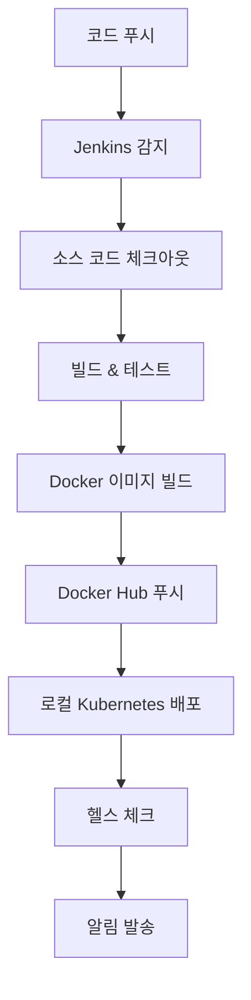

# 개발환경 전용 설정 가이드

## 개요
개발환경 PC에서 사용할 최소한의 설정만 포함된 가이드입니다.

## 제거된 항목들

### 1. GitOps 관련 파일들
- ✅ `k8s/argocd/` - ArgoCD Application 설정
- ✅ `trip-currency-local-gitops/` - GitOps 레포지토리
- ✅ `gitops-setup/` - GitOps 설정 파일들
- ✅ `GITOPS-REPOSITORY-SETUP.md` - GitOps 설정 가이드

### 2. 모니터링 관련 파일들
- ✅ `monitoring-setup/` - Prometheus, Grafana, ELK 설정
- ✅ `하이브리드 클라우드 구축 아키텍처.md` - 하이브리드 클라우드 아키텍처
- ✅ `PRODUCTION-DEPLOYMENT-GUIDE.md` - 프로덕션 배포 가이드

### 3. 운영환경 관련 파일들
- ✅ `JENKINS-ONLY-SETUP.md` - Jenkins 전용 설정 가이드
- ✅ `DEVELOPMENT-JENKINS-SETUP.md` - 개발환경 Jenkins 설정 가이드

## 유지된 항목들

### 1. 핵심 애플리케이션 코드
- ✅ `frontend/` - React 프론트엔드
- ✅ `service-currency/` - 환율 서비스
- ✅ `service-history/` - 히스토리 서비스
- ✅ `service-ranking/` - 랭킹 서비스
- ✅ `service-dataingestor/` - 데이터 수집 서비스
- ✅ `package-shared/` - 공유 패키지

### 2. 운영환경용 파일들 (운영 PC에서 사용)
- ✅ `Jenkinsfile.production` - 운영환경용 Jenkins 파이프라인
- ✅ `env.production` - 운영환경용 환경 설정

### 3. 로컬 Kubernetes 설정
- ✅ `k8s/` - 로컬 Kubernetes 설정 파일들
- ✅ `scripts/` - 초기화 스크립트들

## 개발환경 Jenkins 파이프라인

### 1. 파이프라인 구조
```groovy
pipeline {
    agent any
    
    environment {
        // Docker Hub 설정 (개발환경용)
        DOCKER_REGISTRY = 'docker.io'
        DOCKERHUB_USERNAME = 'your-dockerhub-username'
        IMAGE_NAME = 'trip-service'
        DEV_TAG = "dev-${env.BUILD_NUMBER}"
    }
    
    stages {
        stage('Checkout') { ... }
        stage('Build & Test') { ... }
        stage('Docker Build & Push') { ... }
        stage('Deploy to Local Kubernetes') { ... }
        stage('Health Check') { ... }
    }
}
```

### 2. 파이프라인 플로우


## 개발환경 설정

### 1. 필요한 Credentials
```yaml
# Docker Hub Credentials
ID: dockerhub-credentials
Type: Username with password
Username: [Docker Hub Username]
Password: [Docker Hub Password]

# GitHub Credentials
ID: github-credentials
Type: Username with password
Username: [GitHub Username]
Password: [GitHub Personal Access Token]
```

### 2. Jenkins 플러그인
```bash
# 필요한 플러그인
jenkins-cli install-plugin workflow-aggregator
jenkins-cli install-plugin git
jenkins-cli install-plugin docker-workflow
jenkins-cli install-plugin kubernetes
jenkins-cli install-plugin slack
jenkins-cli install-plugin blueocean
jenkins-cli install-plugin workflow-multibranch
```

### 3. Multibranch Pipeline 설정
```yaml
# Multibranch Pipeline 설정
- Source: Git
- Repository URL: https://github.com/KORgosu/trip-currency-local.git
- Credentials: github-credentials
- Behaviors: Discover branches, Discover pull requests
- Build Configuration: by Jenkinsfile
- Script Path: Jenkinsfile
```

## 푸시되는 이미지들

### 1. Docker Hub 이미지
```bash
# 개발환경 이미지들
your-username/trip-service-frontend:dev-123
your-username/trip-service-frontend:latest

your-username/trip-service-currency:dev-123
your-username/trip-service-currency:latest

your-username/trip-service-history:dev-123
your-username/trip-service-history:latest

your-username/trip-service-ranking:dev-123
your-username/trip-service-ranking:latest
```

### 2. 이미지 태그 전략
```yaml
# 개발환경 태그
- 형식: dev-{BUILD_NUMBER}
- 예시: dev-123, dev-124, dev-125
- 추가: latest 태그도 함께 푸시
```

## 로컬 Kubernetes 배포

### 1. 배포 대상
```yaml
# 로컬 Kubernetes 클러스터
- Namespace: trip-service-dev
- Deployments:
  - service-frontend
  - service-currency
  - service-history
  - service-ranking
```

### 2. 배포 명령어
```bash
# 이미지 태그 업데이트
kubectl set image deployment/service-frontend service-frontend=your-username/trip-service-frontend:dev-123 -n trip-service-dev
kubectl set image deployment/service-currency service-currency=your-username/trip-service-currency:dev-123 -n trip-service-dev
kubectl set image deployment/service-history service-history=your-username/trip-service-history:dev-123 -n trip-service-dev
kubectl set image deployment/service-ranking service-ranking=your-username/trip-service-ranking:dev-123 -n trip-service-dev

# 배포 상태 확인
kubectl rollout status deployment/service-frontend -n trip-service-dev
kubectl rollout status deployment/service-currency -n trip-service-dev
kubectl rollout status deployment/service-history -n trip-service-dev
kubectl rollout status deployment/service-ranking -n trip-service-dev
```

## 알림 설정

### 1. Slack 알림
```groovy
post {
    success {
        slackSend(
            channel: '#development',
            color: 'good',
            message: "✅ ${env.JOB_NAME} - ${env.BUILD_NUMBER} 개발환경 배포 성공!\n이미지 태그: ${DEV_TAG}"
        )
    }
    
    failure {
        slackSend(
            channel: '#development',
            color: 'danger',
            message: "❌ ${env.JOB_NAME} - ${env.BUILD_NUMBER} 개발환경 배포 실패!\n로그 확인: ${env.BUILD_URL}"
        )
    }
}
```

### 2. 이메일 알림
```groovy
post {
    success {
        emailext (
            subject: "✅ ${env.JOB_NAME} - ${env.BUILD_NUMBER} 개발환경 배포 성공",
            body: "개발환경 배포가 성공적으로 완료되었습니다.\n이미지 태그: ${DEV_TAG}",
            to: "dev@trip-service.com"
        )
    }
    
    failure {
        emailext (
            subject: "❌ ${env.JOB_NAME} - ${env.BUILD_NUMBER} 개발환경 배포 실패",
            body: "개발환경 배포가 실패했습니다.\n로그 확인: ${env.BUILD_URL}",
            to: "dev@trip-service.com"
        )
    }
}
```

## 장점

### 1. 단순화
- ✅ **GitOps 제거**: 복잡한 GitOps 설정 제거
- ✅ **모니터링 제거**: 운영환경에서만 모니터링
- ✅ **로컬 배포**: 로컬 Kubernetes에 직접 배포
- ✅ **Docker Hub**: 무료 Docker Hub 사용

### 2. 개발 효율성
- ✅ **빠른 배포**: 로컬 환경에 즉시 배포
- ✅ **간단한 설정**: 최소한의 설정으로 동작
- ✅ **디버깅 용이**: 로컬 환경에서 쉽게 디버깅

### 3. 비용 절약
- ✅ **Docker Hub**: 무료 사용
- ✅ **로컬 리소스**: 로컬 PC 리소스만 사용
- ✅ **외부 의존성 최소화**: 외부 서비스 의존성 최소화

## 다음 단계

### 1. Jenkins 설치 및 설정
```bash
# Jenkins 설치
sudo apt-get install jenkins

# 플러그인 설치
jenkins-cli install-plugin workflow-aggregator
jenkins-cli install-plugin git
jenkins-cli install-plugin docker-workflow
```

### 2. Credentials 설정
- Docker Hub 인증 정보
- GitHub Personal Access Token

### 3. Multibranch Pipeline 생성
- Git 저장소 연결
- 브랜치 자동 감지
- 파이프라인 실행

### 4. 테스트 및 검증
- 개발환경 배포 테스트
- 헬스 체크 확인
- 알림 테스트

## 결론

개발환경 PC에서는 **최소한의 설정만 필요**합니다:

### 유지된 항목들
- ✅ **애플리케이션 코드**: frontend, service-*, package-shared
- ✅ **Jenkinsfile**: 개발환경 전용 Jenkins 파이프라인
- ✅ **Jenkins 설정**: jenkins-setup/
- ✅ **로컬 Kubernetes**: k8s/ (로컬 배포용)
- ✅ **초기화 스크립트**: scripts/

### 제거된 항목들
- ❌ **GitOps**: ArgoCD, GitOps 레포지토리
- ❌ **모니터링**: Prometheus, Grafana, ELK
- ❌ **운영환경**: 프로덕션 배포 가이드
- ❌ **하이브리드 클라우드**: AWS, 온프레미스 설정

**개발환경 PC는 순수하게 개발용으로만 사용되고, 운영환경은 별도로 구축하는 것이 맞습니다!** 🎯
