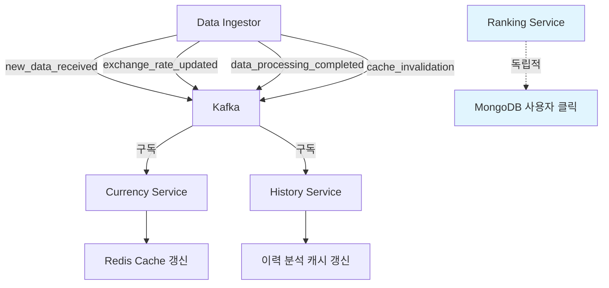

# Kafka 이벤트 기반 아키텍처

이 문서는 환율 서비스의 Kafka 이벤트 기반 아키텍처를 설명합니다.

## 개요

Data Ingestor가 외부 API에서 새로운 환율 데이터를 수신할 때마다 Kafka를 통해 이벤트를 발행하고, 다른 서비스들이 이를 구독하여 실시간으로 데이터를 갱신하는 구조입니다.

## 서비스별 Kafka 구독 현황

### ✅ 구독 서비스
- **Currency Service**: 환율 데이터 업데이트 구독 및 캐시 관리
- **History Service**: 환율 데이터 업데이트 구독 및 분석 캐시 관리

### ❌ 구독하지 않는 서비스
- **Data Ingestor**: 이벤트 발행만 담당
- **Ranking Service**: 독립적 서비스 (사용자 클릭 데이터에만 의존)

## 이벤트 흐름



## Kafka 토픽

### 1. new_data_received
- **발행자**: Data Ingestor
- **구독자**: Currency Service, History Service
- **목적**: 새로운 환율 데이터가 수신되었음을 알림

```json
{
  "source": "exchangerate_api",
  "data_count": 60,
  "collection_time": "2025-01-27T10:00:00Z",
  "processing_time_ms": 1500,
  "correlation_id": "uuid-1234"
}
```

### 2. exchange_rate_updated
- **발행자**: Data Ingestor
- **구독자**: Currency Service, History Service
- **목적**: 특정 통화의 환율이 업데이트되었음을 알림

```json
{
  "currency_code": "USD",
  "currency_name": "미국 달러",
  "deal_base_rate": 1330.50,
  "tts": 1335.20,
  "ttb": 1325.80,
  "source": "exchangerate_api",
  "recorded_at": "2025-01-27T10:00:00Z",
  "updated_at": "2025-01-27T10:00:01Z"
}
```

### 3. data_processing_completed
- **발행자**: Data Ingestor
- **구독자**: Currency Service, History Service
- **목적**: 데이터 처리 작업이 완료되었음을 알림

```json
{
  "source": "exchangerate_api",
  "total_processed": 60,
  "processing_time_ms": 1500,
  "completed_at": "2025-01-27T10:00:02Z",
  "correlation_id": "uuid-1234"
}
```

### 4. cache_invalidation
- **발행자**: Data Ingestor
- **구독자**: Currency Service, History Service
- **목적**: 캐시 무효화가 필요함을 알림

```json
{
  "cache_keys": [
    "exchange_rate:USD",
    "exchange_rate:JPY",
    "exchange_rate:EUR"
  ],
  "invalidation_type": "exchange_rate_update",
  "invalidated_at": "2025-01-27T10:00:02Z"
}
```

## 서비스별 이벤트 처리

### Currency Service 이벤트 처리

```python
async def handle_new_data_received(message: dict):
    """새로운 데이터 수신 이벤트 처리"""
    # 전체 환율 캐시 새로고침 준비
    logger.info("Preparing for new exchange rate data refresh")

async def handle_exchange_rate_updated(message: dict):
    """환율 업데이트 이벤트 처리"""
    # 특정 통화의 캐시 무효화 및 갱신
    await currency_provider.clear_cache(currency_code)
    await currency_provider.refresh_currency_cache(currency_code)

async def handle_data_processing_completed(message: dict):
    """데이터 처리 완료 이벤트 처리"""
    # 모든 환율 캐시 새로고침
    await currency_provider.refresh_all_currency_cache()

async def handle_cache_invalidation(message: dict):
    """캐시 무효화 이벤트 처리"""
    # 특정 통화 또는 전체 캐시 무효화
    for key in cache_keys:
        if key.startswith("exchange_rate:"):
            currency_code = key.split(":")[1]
            await currency_provider.clear_cache(currency_code)
```

### History Service 이벤트 처리

```python
async def handle_new_data_received(message: dict):
    """새로운 데이터 수신 이벤트 처리"""
    # 분석 캐시 무효화
    await analysis_provider.clear_analysis_cache()

async def handle_exchange_rate_updated(message: dict):
    """환율 업데이트 이벤트 처리"""
    # 특정 통화의 이력 캐시 무효화
    await history_provider.clear_currency_history_cache(currency_code)

async def handle_data_processing_completed(message: dict):
    """데이터 처리 완료 이벤트 처리"""
    # 전체 통계 캐시 무효화
    await analysis_provider.clear_all_statistics_cache()

async def handle_cache_invalidation(message: dict):
    """캐시 무효화 이벤트 처리"""
    # 이력 및 분석 캐시 무효화
    await history_provider.clear_all_history_cache()
    await analysis_provider.clear_all_statistics_cache()
```

## 토픽 생성 및 관리

### 자동 토픽 생성
Docker Compose 시작 시 자동으로 필요한 토픽들이 생성됩니다:

```bash
# 토픽 생성 확인
docker exec currency-kafka kafka-topics.sh --list --bootstrap-server localhost:9092
```

### 수동 토픽 생성
```bash
# 개별 토픽 생성
docker exec currency-kafka kafka-topics.sh \
  --create \
  --topic new_data_received \
  --partitions 3 \
  --replication-factor 1 \
  --bootstrap-server localhost:9092
```

## 메시지 발행 및 구독

### 메시지 발행 (Data Ingestor)
```python
from shared.messaging import send_new_data_received

# 새로운 데이터 수신 이벤트 발행
await send_new_data_received({
    "source": "exchangerate_api",
    "data_count": 60,
    "collection_time": "2025-01-27T10:00:00Z"
})
```

### 메시지 구독 (Currency Service, History Service)
```python
from shared.messaging import MessageConsumer

# 컨슈머 초기화
topics = ["new_data_received", "exchange_rate_updated", "data_processing_completed", "cache_invalidation"]
consumer = MessageConsumer(topics, "currency-service")
await consumer.initialize()

# 메시지 소비 시작
await consumer.consume_messages(handle_kafka_message)
```

## 캐시 관리 전략

### Currency Service 캐시
- **Redis 키 패턴**: `rate:{currency_code}`
- **TTL**: 10분
- **갱신 전략**: 이벤트 기반 무효화 + 즉시 갱신

### History Service 캐시
- **Redis 키 패턴**: `history:*`, `stats:*`, `analysis:*`
- **TTL**: 기간별 다름 (15분~1시간)
- **갱신 전략**: 이벤트 기반 무효화

## 모니터링 및 로깅

### 이벤트 발행 로그
```python
logger.info("New data received event sent", source="exchangerate_api")
logger.info("Exchange rate updated event sent", currency="USD")
logger.info("Data processing completed event sent", total_processed=60)
logger.info("Cache invalidation event sent")
```

### 이벤트 수신 로그
```python
logger.info("Received Kafka message from topic: new_data_received")
logger.info("New data received event processed", source="exchangerate_api", data_count=60)
logger.info("Cache cleared for updated currency: USD")
```

## 성능 최적화

### 파티션 전략
- **new_data_received**: 1개 파티션 (순서 보장)
- **exchange_rate_updated**: 3개 파티션 (병렬 처리)
- **data_processing_completed**: 1개 파티션 (순서 보장)
- **cache_invalidation**: 1개 파티션 (순서 보장)

### 배치 처리
- 컨슈머는 메시지를 배치로 처리하여 성능 최적화
- Redis 캐시 업데이트는 비동기로 처리

## 문제 해결

### 자주 발생하는 문제

1. **토픽이 생성되지 않는 경우**
   ```bash
   # Kafka 컨테이너 상태 확인
   docker ps | grep kafka
   
   # 토픽 수동 생성
   docker exec currency-kafka kafka-topics.sh --create --topic new_data_received --bootstrap-server localhost:9092
   ```

2. **메시지가 전송되지 않는 경우**
   ```bash
   # Kafka 로그 확인
   docker logs currency-kafka
   
   # 네트워크 연결 확인
   docker exec currency-kafka kafka-topics.sh --list --bootstrap-server localhost:9092
   ```

3. **컨슈머가 메시지를 받지 못하는 경우**
   ```bash
   # 컨슈머 그룹 상태 확인
   docker exec currency-kafka kafka-consumer-groups.sh --bootstrap-server localhost:9092 --list
   
   # 오프셋 확인
   docker exec currency-kafka kafka-consumer-groups.sh --bootstrap-server localhost:9092 --group currency-service --describe
   ```

## 참고 자료

- [Kafka 공식 문서](https://kafka.apache.org/documentation/)
- [aiokafka Python 라이브러리](https://aiokafka.readthedocs.io/)
- [Kafka UI](https://docs.kafka-ui.provectus.io/)