# Trip Service Kubernetes 배포 가이드
## Single Cluster + Namespace 분리 전략 구현

### 📋 목차
1. [전략 개요](#전략-개요)
2. [레포지토리 구조](#레포지토리-구조)
3. [Kubernetes 구조 설계](#kubernetes-구조-설계)
4. [단계별 구현 가이드](#단계별-구현-가이드)
5. [CI/CD 파이프라인 설정](#cicd-파이프라인-설정)
6. [배포 및 운영](#배포-및-운영)

---

## 전략 개요

### 🎯 아키텍처
- **Single Cluster + Namespace 분리**: 하나의 Kubernetes 클러스터 내에서 환경별로 네임스페이스를 분리
- **Mono Repository**: 모든 서비스를 하나의 레포지토리에서 관리
- **Jenkins + ArgoCD**: CI/CD 파이프라인과 GitOps 배포 전략

### 💡 이 전략을 선택한 이유

#### 1. **운영 복잡성 최소화**
- 하나의 클러스터만 관리하면 되므로 운영 부담 감소
- 네임스페이스로 환경 격리는 충분히 가능
- 리소스 공유를 통한 효율성 증대

#### 2. **비용 효율성**
- 멀티 클러스터 대비 인프라 비용 절약
- 리소스 풀링으로 전체 활용률 향상
- 개발/스테이징 환경에서 리소스 공유 가능

#### 3. **개발 생산성**
- 모든 서비스가 한 레포지토리에 있어 크로스 서비스 개발 용이
- 공유 패키지 관리 간소화
- 통합된 버전 관리

#### 4. **CI/CD 단순화**
- 하나의 Jenkins 파이프라인으로 모든 서비스 관리
- 변경 감지 로직으로 필요한 서비스만 빌드
- GitOps 배포로 일관된 배포 프로세스

---

## 레포지토리 구조

### 🔄 현재 vs 목표 구조

#### 현재 구조 (유지)
```
trip-service-local/
├── service-currency/
├── service-history/
├── service-ranking/
├── service-dataingestor/
├── frontend/
├── package-shared/
├── scripts/
└── docker-compose.yml    # 로컬 개발용 유지
```

#### 추가할 구조
```
trip-service-local/
├── [기존 구조 그대로 유지]
├── k8s/                  # 👈 새로 추가
│   ├── base/
│   │   ├── namespace.yaml
│   │   ├── configmap.yaml
│   │   ├── secrets.yaml
│   │   ├── kustomization.yaml
│   │   ├── metallb/                  # 👈 MetalLB 설정
│   │   │   └── ipaddresspool.yaml
│   │   ├── ingress-controller/       # 👈 Ingress Controller
│   │   │   ├── nginx-controller.yaml
│   │   │   └── rbac.yaml
│   │   ├── ingress/                  # 👈 Ingress 규칙
│   │   │   └── trip-service-ingress.yaml
│   │   ├── mysql/
│   │   │   ├── deployment.yaml
│   │   │   ├── service.yaml
│   │   │   ├── configmap.yaml
│   │   │   └── pvc.yaml
│   │   ├── mongodb/
│   │   │   ├── deployment.yaml
│   │   │   ├── service.yaml
│   │   │   └── pvc.yaml
│   │   ├── redis/
│   │   │   ├── deployment.yaml
│   │   │   └── service.yaml
│   │   ├── kafka/
│   │   │   ├── zookeeper.yaml
│   │   │   ├── kafka.yaml
│   │   │   ├── kafka-ui.yaml
│   │   │   └── topics-job.yaml
│   │   └── services/
│   │       ├── currency-service/
│   │       │   ├── deployment.yaml
│   │       │   ├── service.yaml
│   │       │   └── hpa.yaml
│   │       ├── history-service/
│   │       ├── ranking-service/
│   │       ├── dataingestor-service/
│   │       └── frontend/
│   └── overlays/         # 👈 환경별 설정
│       ├── dev/
│       │   ├── kustomization.yaml
│       │   ├── namespace.yaml
│       │   ├── configmap.yaml
│       │   ├── resource-quota.yaml
│       │   └── ingress-patch.yaml    # 👈 개발환경 도메인
│       ├── staging/
│       │   ├── kustomization.yaml
│       │   ├── namespace.yaml
│       │   ├── configmap.yaml
│       │   ├── resource-quota.yaml
│       │   └── ingress-patch.yaml
│       └── prod/
│           ├── kustomization.yaml
│           ├── namespace.yaml
│           ├── configmap.yaml
│           ├── resource-quota.yaml
│           ├── network-policies.yaml
│           └── ingress-patch.yaml    # 👈 프로덕션 도메인
├── config/               # 👈 환경별 설정
│   ├── dev/
│   │   └── .env
│   ├── staging/
│   │   └── .env
│   └── prod/
│       └── .env
├── helm/                 # 👈 선택적 (Helm 사용시)
│   ├── Chart.yaml
│   ├── values.yaml
│   ├── values-dev.yaml
│   ├── values-staging.yaml
│   ├── values-prod.yaml
│   └── templates/
└── .github/workflows/    # 👈 CI/CD 워크플로우
    ├── ci.yml
    └── cd.yml
```

### 📁 새로 생성할 레포지토리

**총 2개의 레포지토리만 필요:**

1. **`trip-service-mono`** (메인 애플리케이션)
   - 모든 서비스 코드
   - Kubernetes 매니페스트
   - Docker 설정
   - CI/CD 설정

2. **`trip-service-config`** (GitOps용 설정)
   - ArgoCD 애플리케이션 정의
   - 환경별 배포 설정
   - Helm values 오버라이드

---

## Kubernetes 구조 설계

### 🏗️ 클러스터 및 네임스페이스 구조

```
Kubernetes Cluster: trip-service-cluster
├── trip-service-dev        # 개발 환경
│   ├── mysql-dev
│   ├── mongodb-dev
│   ├── redis-dev
│   ├── kafka-dev
│   ├── zookeeper-dev
│   ├── currency-service-dev
│   ├── history-service-dev
│   ├── ranking-service-dev
│   ├── dataingestor-service-dev
│   ├── frontend-dev
│   └── kafka-ui-dev
├── trip-service-staging    # 스테이징 환경
│   └── [동일한 서비스들]
└── trip-service-prod       # 프로덕션 환경
    └── [동일한 서비스들]
```

### 🔐 보안 및 리소스 격리

#### 네임스페이스별 격리 요소
- **Network Policies**: 네임스페이스 간 네트워크 격리
- **Resource Quotas**: 환경별 리소스 사용량 제한
- **RBAC**: 환경별 접근 권한 관리
- **Service Accounts**: 서비스별 권한 분리

---

## 단계별 구현 가이드

### 📝 Phase 1: 기본 구조 생성

#### 1-1. k8s 디렉토리 생성
```bash
# 기본 디렉토리 구조 생성
mkdir -p k8s/{base,overlays}
mkdir -p k8s/overlays/{dev,staging,prod}

# MetalLB 및 Ingress 디렉토리
mkdir -p k8s/base/{metallb,ingress-controller,ingress}

# 데이터베이스 및 메시지 큐 디렉토리
mkdir -p k8s/base/{mysql,mongodb,redis,kafka}

# 서비스 디렉토리
mkdir -p k8s/base/services/{currency-service,history-service,ranking-service,dataingestor-service,frontend}

# 환경별 설정 디렉토리
mkdir -p config/{dev,staging,prod}
```

#### 1-2. 네임스페이스 매니페스트 생성

**k8s/base/namespace.yaml**
```yaml
apiVersion: v1
kind: Namespace
metadata:
  name: trip-service-dev
  labels:
    name: trip-service-dev
    environment: dev
---
apiVersion: v1
kind: Namespace
metadata:
  name: trip-service-staging
  labels:
    name: trip-service-staging
    environment: staging
---
apiVersion: v1
kind: Namespace
metadata:
  name: trip-service-prod
  labels:
    name: trip-service-prod
    environment: prod
```

**📋 생성 이유**: 환경별 리소스 격리와 RBAC 적용을 위해 네임스페이스를 먼저 정의합니다.

#### 1-3. ConfigMap 기본 템플릿

**k8s/base/configmap.yaml**
```yaml
apiVersion: v1
kind: ConfigMap
metadata:
  name: trip-service-config
data:
  # Database Configuration
  MYSQL_HOST: "mysql-service"
  MYSQL_PORT: "3306"
  MYSQL_DATABASE: "trip_service"

  # MongoDB Configuration
  MONGODB_HOST: "mongodb-service"
  MONGODB_PORT: "27017"
  MONGODB_DATABASE: "trip_service"

  # Redis Configuration
  REDIS_HOST: "redis-service"
  REDIS_PORT: "6379"

  # Kafka Configuration
  KAFKA_BOOTSTRAP_SERVERS: "kafka-service:9092"

  # Service URLs
  CURRENCY_SERVICE_URL: "http://currency-service:8000"
  HISTORY_SERVICE_URL: "http://history-service:8000"
  RANKING_SERVICE_URL: "http://ranking-service:8000"
  DATAINGESTOR_SERVICE_URL: "http://dataingestor-service:8000"
```

**📋 생성 이유**: 서비스 간 통신과 외부 의존성 설정을 중앙 집중화하여 관리 복잡성을 줄입니다.

### 📝 Phase 2: MetalLB 및 Ingress 설정 (온프레미스 외부 접근)

#### 2-1. MetalLB 설치 및 설정

**1️⃣ MetalLB 설치**
```bash
# MetalLB 설치
kubectl apply -f https://raw.githubusercontent.com/metallb/metallb/v0.13.7/config/manifests/metallb-native.yaml

# 설치 확인
kubectl get pods -n metallb-system
```

**2️⃣ IP 주소 풀 설정**

**k8s/base/metallb/ipaddresspool.yaml**
```yaml
apiVersion: metallb.io/v1beta1
kind: IPAddressPool
metadata:
  name: trip-service-pool
  namespace: metallb-system
spec:
  addresses:
  # 👇 실제 환경에 맞게 수정 필요
  - 192.168.1.100-192.168.1.110  # 10개 IP 할당

  # 대안 1: 단일 IP
  # - 192.168.1.100/32

  # 대안 2: CIDR 범위
  # - 192.168.1.100/29  # 192.168.1.100-107 (8개 IP)

  # 주의: 이 IP들은 다른 장치에서 사용하지 않는 범위여야 함
---
apiVersion: metallb.io/v1beta1
kind: L2Advertisement
metadata:
  name: trip-service-l2
  namespace: metallb-system
spec:
  ipAddressPools:
  - trip-service-pool
  # L2 모드: 같은 네트워크 세그먼트에서 ARP로 IP 광고
```

**📋 MetalLB 선택 이유**:
- **온프레미스 LoadBalancer**: 클라우드 없이도 LoadBalancer 타입 서비스 사용 가능
- **자동 IP 할당**: 서비스마다 자동으로 외부 IP 할당
- **클라우드와 동일한 경험**: AWS/GCP ELB와 유사한 사용법

#### 2-2. NGINX Ingress Controller 설정

**k8s/base/ingress-controller/nginx-controller.yaml**
```yaml
apiVersion: v1
kind: Namespace
metadata:
  name: ingress-nginx
  labels:
    app.kubernetes.io/name: ingress-nginx
    app.kubernetes.io/instance: ingress-nginx
---
# NGINX Ingress Controller Deployment
apiVersion: apps/v1
kind: Deployment
metadata:
  name: nginx-ingress-controller
  namespace: ingress-nginx
  labels:
    app.kubernetes.io/name: ingress-nginx
    app.kubernetes.io/part-of: ingress-nginx
spec:
  replicas: 2  # 고가용성을 위해 2개 실행
  selector:
    matchLabels:
      app.kubernetes.io/name: ingress-nginx
      app.kubernetes.io/part-of: ingress-nginx
  template:
    metadata:
      labels:
        app.kubernetes.io/name: ingress-nginx
        app.kubernetes.io/part-of: ingress-nginx
    spec:
      serviceAccountName: nginx-ingress-serviceaccount
      containers:
      - name: nginx-ingress-controller
        image: registry.k8s.io/ingress-nginx/controller:v1.8.1
        args:
        - /nginx-ingress-controller
        - --configmap=$(POD_NAMESPACE)/nginx-configuration
        - --publish-service=$(POD_NAMESPACE)/ingress-nginx
        - --annotations-prefix=nginx.ingress.kubernetes.io
        - --enable-ssl-passthrough
        env:
        - name: POD_NAME
          valueFrom:
            fieldRef:
              fieldPath: metadata.name
        - name: POD_NAMESPACE
          valueFrom:
            fieldRef:
              fieldPath: metadata.namespace
        ports:
        - name: http
          containerPort: 80
          protocol: TCP
        - name: https
          containerPort: 443
          protocol: TCP
        resources:
          requests:
            cpu: 100m
            memory: 90Mi
          limits:
            cpu: 500m
            memory: 256Mi
---
# MetalLB LoadBalancer Service
apiVersion: v1
kind: Service
metadata:
  name: ingress-nginx
  namespace: ingress-nginx
  labels:
    app.kubernetes.io/name: ingress-nginx
    app.kubernetes.io/part-of: ingress-nginx
  annotations:
    # MetalLB 설정
    metallb.universe.tf/address-pool: trip-service-pool
    metallb.universe.tf/allow-shared-ip: "true"
spec:
  type: LoadBalancer  # MetalLB가 External IP 할당
  selector:
    app.kubernetes.io/name: ingress-nginx
    app.kubernetes.io/part-of: ingress-nginx
  ports:
  - name: http
    port: 80
    targetPort: 80
    protocol: TCP
  - name: https
    port: 443
    targetPort: 443
    protocol: TCP
```

#### 2-3. Ingress 규칙 설정

**k8s/base/ingress/trip-service-ingress.yaml**
```yaml
apiVersion: networking.k8s.io/v1
kind: Ingress
metadata:
  name: trip-service-main-ingress
  annotations:
    kubernetes.io/ingress.class: "nginx"
    nginx.ingress.kubernetes.io/rewrite-target: /
    nginx.ingress.kubernetes.io/ssl-redirect: "false"  # HTTP 허용 (개발시)
    nginx.ingress.kubernetes.io/proxy-body-size: "100m"
    # CORS 설정
    nginx.ingress.kubernetes.io/enable-cors: "true"
    nginx.ingress.kubernetes.io/cors-allow-origin: "*"
    nginx.ingress.kubernetes.io/cors-allow-methods: "GET, POST, PUT, DELETE, OPTIONS"
spec:
  rules:
  # Frontend 도메인
  - host: trip-service.local
    http:
      paths:
      - path: /
        pathType: Prefix
        backend:
          service:
            name: frontend-service
            port:
              number: 80

  # API 도메인
  - host: api.trip-service.local
    http:
      paths:
      # Currency Service
      - path: /currency
        pathType: Prefix
        backend:
          service:
            name: currency-service
            port:
              number: 8000

      # History Service
      - path: /history
        pathType: Prefix
        backend:
          service:
            name: history-service
            port:
              number: 8000

      # Ranking Service
      - path: /ranking
        pathType: Prefix
        backend:
          service:
            name: ranking-service
            port:
              number: 8000

---
# 관리도구용 Ingress
apiVersion: networking.k8s.io/v1
kind: Ingress
metadata:
  name: trip-service-admin-ingress
  annotations:
    kubernetes.io/ingress.class: "nginx"
    nginx.ingress.kubernetes.io/rewrite-target: /
    nginx.ingress.kubernetes.io/ssl-redirect: "false"
    # 관리도구는 기본 인증 추가
    nginx.ingress.kubernetes.io/auth-type: basic
    nginx.ingress.kubernetes.io/auth-secret: basic-auth
    nginx.ingress.kubernetes.io/auth-realm: 'Authentication Required - Trip Service Admin'
spec:
  rules:
  # Kafka UI
  - host: kafka-ui.trip-service.local
    http:
      paths:
      - path: /
        pathType: Prefix
        backend:
          service:
            name: kafka-ui-service
            port:
              number: 8080
```

**📋 Ingress 설정 이유**:
- **단일 진입점**: 모든 서비스를 하나의 IP로 접근 가능
- **도메인 기반 라우팅**: 서비스별로 다른 도메인/경로 사용
- **SSL 종료**: Ingress에서 SSL 처리로 백엔드 부하 감소
- **인증 및 보안**: 관리도구에 기본 인증 적용

#### 2-4. 환경별 도메인 설정

**k8s/overlays/dev/ingress-patch.yaml**
```yaml
# 개발 환경용 Ingress 설정
apiVersion: networking.k8s.io/v1
kind: Ingress
metadata:
  name: trip-service-main-ingress
  annotations:
    nginx.ingress.kubernetes.io/ssl-redirect: "false"  # 개발환경에서는 HTTP 허용
spec:
  rules:
  - host: dev.trip-service.local        # 개발 환경 도메인
    http:
      paths:
      - path: /
        pathType: Prefix
        backend:
          service:
            name: frontend-service
            port:
              number: 80

  - host: api-dev.trip-service.local    # 개발 API 도메인
    http:
      paths:
      - path: /currency
        pathType: Prefix
        backend:
          service:
            name: currency-service
            port:
              number: 8000
      # ... 다른 서비스들
```

**k8s/overlays/prod/ingress-patch.yaml**
```yaml
# 프로덕션 환경용 Ingress 설정
apiVersion: networking.k8s.io/v1
kind: Ingress
metadata:
  name: trip-service-main-ingress
  annotations:
    nginx.ingress.kubernetes.io/ssl-redirect: "true"   # 프로덕션에서는 HTTPS 강제
    cert-manager.io/cluster-issuer: "letsencrypt-prod"  # SSL 인증서 자동 발급
    nginx.ingress.kubernetes.io/rate-limit: "100"      # Rate limiting
spec:
  tls:
  - hosts:
    - trip-service.example.com
    - api.trip-service.example.com
    secretName: trip-service-tls-prod
  rules:
  - host: trip-service.example.com      # 실제 프로덕션 도메인
    http:
      paths:
      - path: /
        pathType: Prefix
        backend:
          service:
            name: frontend-service
            port:
              number: 80
  # ... API 도메인 설정
```

#### 2-5. DNS 설정 또는 hosts 파일

**로컬 테스트용 hosts 파일 설정**
```bash
# Windows: C:\Windows\System32\drivers\etc\hosts
# Linux/Mac: /etc/hosts

# MetalLB에서 할당받은 IP (예: 192.168.1.100)
192.168.1.100  dev.trip-service.local
192.168.1.100  api-dev.trip-service.local
192.168.1.100  kafka-ui.trip-service.local
```

### 📝 Phase 3: 데이터베이스 및 인프라 서비스

#### 3-1. MySQL 매니페스트

**k8s/base/mysql/deployment.yaml**
```yaml
apiVersion: apps/v1
kind: Deployment
metadata:
  name: mysql
  labels:
    app: mysql
spec:
  replicas: 1
  selector:
    matchLabels:
      app: mysql
  template:
    metadata:
      labels:
        app: mysql
    spec:
      containers:
      - name: mysql
        image: mysql:8.0
        env:
        - name: MYSQL_ROOT_PASSWORD
          valueFrom:
            secretKeyRef:
              name: mysql-secret
              key: root-password
        - name: MYSQL_DATABASE
          value: "trip_service"
        - name: MYSQL_USER
          value: "trip_user"
        - name: MYSQL_PASSWORD
          valueFrom:
            secretKeyRef:
              name: mysql-secret
              key: user-password
        ports:
        - containerPort: 3306
        volumeMounts:
        - name: mysql-storage
          mountPath: /var/lib/mysql
        - name: init-script
          mountPath: /docker-entrypoint-initdb.d
      volumes:
      - name: mysql-storage
        persistentVolumeClaim:
          claimName: mysql-pvc
      - name: init-script
        configMap:
          name: mysql-init-script
```

**k8s/base/mysql/service.yaml**
```yaml
apiVersion: v1
kind: Service
metadata:
  name: mysql-service
spec:
  selector:
    app: mysql
  ports:
  - port: 3306
    targetPort: 3306
  type: ClusterIP
```

**k8s/base/mysql/pvc.yaml**
```yaml
apiVersion: v1
kind: PersistentVolumeClaim
metadata:
  name: mysql-pvc
spec:
  accessModes:
    - ReadWriteOnce
  resources:
    requests:
      storage: 10Gi
```

**📋 생성 이유**:
- **PVC 사용**: 데이터 영속성 보장, 파드 재시작 시에도 데이터 유지
- **Secret 분리**: 민감한 정보(패스워드)를 코드와 분리하여 보안 강화
- **ConfigMap으로 초기화**: 기존 init-db.sql을 활용하여 초기 데이터 설정

#### 3-2. MongoDB 매니페스트

**k8s/base/mongodb/deployment.yaml**
```yaml
apiVersion: apps/v1
kind: Deployment
metadata:
  name: mongodb
  labels:
    app: mongodb
spec:
  replicas: 1
  selector:
    matchLabels:
      app: mongodb
  template:
    metadata:
      labels:
        app: mongodb
    spec:
      containers:
      - name: mongodb
        image: mongo:6.0
        env:
        - name: MONGO_INITDB_ROOT_USERNAME
          value: "admin"
        - name: MONGO_INITDB_ROOT_PASSWORD
          valueFrom:
            secretKeyRef:
              name: mongodb-secret
              key: root-password
        - name: MONGO_INITDB_DATABASE
          value: "trip_service"
        ports:
        - containerPort: 27017
        volumeMounts:
        - name: mongodb-storage
          mountPath: /data/db
        - name: init-script
          mountPath: /docker-entrypoint-initdb.d
      volumes:
      - name: mongodb-storage
        persistentVolumeClaim:
          claimName: mongodb-pvc
      - name: init-script
        configMap:
          name: mongodb-init-script
```

#### 3-3. Kafka 클러스터

**k8s/base/kafka/zookeeper.yaml**
```yaml
apiVersion: apps/v1
kind: Deployment
metadata:
  name: zookeeper
  labels:
    app: zookeeper
spec:
  replicas: 1
  selector:
    matchLabels:
      app: zookeeper
  template:
    metadata:
      labels:
        app: zookeeper
    spec:
      containers:
      - name: zookeeper
        image: confluentinc/cp-zookeeper:7.4.0
        env:
        - name: ZOOKEEPER_CLIENT_PORT
          value: "2181"
        - name: ZOOKEEPER_TICK_TIME
          value: "2000"
        ports:
        - containerPort: 2181
---
apiVersion: v1
kind: Service
metadata:
  name: zookeeper-service
spec:
  selector:
    app: zookeeper
  ports:
  - port: 2181
    targetPort: 2181
```

**k8s/base/kafka/kafka.yaml**
```yaml
apiVersion: apps/v1
kind: Deployment
metadata:
  name: kafka
  labels:
    app: kafka
spec:
  replicas: 1
  selector:
    matchLabels:
      app: kafka
  template:
    metadata:
      labels:
        app: kafka
    spec:
      containers:
      - name: kafka
        image: confluentinc/cp-kafka:7.4.0
        env:
        - name: KAFKA_BROKER_ID
          value: "1"
        - name: KAFKA_ZOOKEEPER_CONNECT
          value: "zookeeper-service:2181"
        - name: KAFKA_ADVERTISED_LISTENERS
          value: "PLAINTEXT://kafka-service:9092"
        - name: KAFKA_OFFSETS_TOPIC_REPLICATION_FACTOR
          value: "1"
        - name: KAFKA_AUTO_CREATE_TOPICS_ENABLE
          value: "true"
        ports:
        - containerPort: 9092
---
apiVersion: v1
kind: Service
metadata:
  name: kafka-service
spec:
  selector:
    app: kafka
  ports:
  - port: 9092
    targetPort: 9092
```

**📋 생성 이유**:
- **이벤트 기반 아키텍처**: 서비스 간 비동기 통신을 위한 메시지 큐
- **확장성**: 향후 서비스 추가 시 이벤트 기반으로 쉽게 연동 가능

### 📝 Phase 4: 애플리케이션 서비스

#### 4-1. Currency Service

**k8s/base/services/currency-service/deployment.yaml**
```yaml
apiVersion: apps/v1
kind: Deployment
metadata:
  name: currency-service
  labels:
    app: currency-service
spec:
  replicas: 2
  selector:
    matchLabels:
      app: currency-service
  template:
    metadata:
      labels:
        app: currency-service
    spec:
      containers:
      - name: currency-service
        image: trip-service/currency-service:latest
        envFrom:
        - configMapRef:
            name: trip-service-config
        - secretRef:
            name: trip-service-secrets
        ports:
        - containerPort: 8000
        livenessProbe:
          httpGet:
            path: /health
            port: 8000
          initialDelaySeconds: 30
          periodSeconds: 10
        readinessProbe:
          httpGet:
            path: /health
            port: 8000
          initialDelaySeconds: 5
          periodSeconds: 5
        resources:
          requests:
            memory: "256Mi"
            cpu: "100m"
          limits:
            memory: "512Mi"
            cpu: "500m"
```

**k8s/base/services/currency-service/service.yaml**
```yaml
apiVersion: v1
kind: Service
metadata:
  name: currency-service
spec:
  selector:
    app: currency-service
  ports:
  - port: 8000
    targetPort: 8000
  type: ClusterIP
```

**k8s/base/services/currency-service/hpa.yaml**
```yaml
apiVersion: autoscaling/v2
kind: HorizontalPodAutoscaler
metadata:
  name: currency-service-hpa
spec:
  scaleTargetRef:
    apiVersion: apps/v1
    kind: Deployment
    name: currency-service
  minReplicas: 2
  maxReplicas: 10
  metrics:
  - type: Resource
    resource:
      name: cpu
      target:
        type: Utilization
        averageUtilization: 70
  - type: Resource
    resource:
      name: memory
      target:
        type: Utilization
        averageUtilization: 80
```

**📋 생성 이유**:
- **고가용성**: 최소 2개 replica로 서비스 연속성 보장
- **자동 확장**: HPA로 트래픽 증가에 대응
- **헬스체크**: 문제 발생 시 자동 복구

#### 4-2. Frontend Service

**k8s/base/services/frontend/deployment.yaml**
```yaml
apiVersion: apps/v1
kind: Deployment
metadata:
  name: frontend
  labels:
    app: frontend
spec:
  replicas: 3
  selector:
    matchLabels:
      app: frontend
  template:
    metadata:
      labels:
        app: frontend
    spec:
      containers:
      - name: frontend
        image: trip-service/frontend:latest
        ports:
        - containerPort: 80
        env:
        - name: REACT_APP_API_BASE_URL
          valueFrom:
            configMapKeyRef:
              name: frontend-config
              key: api-base-url
        resources:
          requests:
            memory: "128Mi"
            cpu: "50m"
          limits:
            memory: "256Mi"
            cpu: "200m"
```

### 📝 Phase 5: 환경별 설정 (Kustomize)

#### 5-1. 개발 환경

**k8s/overlays/dev/kustomization.yaml**
```yaml
apiVersion: kustomize.config.k8s.io/v1beta1
kind: Kustomization

namespace: trip-service-dev

resources:
- ../../base/namespace.yaml
- ../../base/configmap.yaml
- ../../base/mysql
- ../../base/mongodb
- ../../base/redis
- ../../base/kafka
- ../../base/services/currency-service
- ../../base/services/history-service
- ../../base/services/ranking-service
- ../../base/services/dataingestor-service
- ../../base/services/frontend

patchesStrategicMerge:
- configmap.yaml
- resource-quota.yaml

images:
- name: trip-service/currency-service
  newTag: dev-latest
- name: trip-service/history-service
  newTag: dev-latest
- name: trip-service/ranking-service
  newTag: dev-latest
- name: trip-service/dataingestor-service
  newTag: dev-latest
- name: trip-service/frontend
  newTag: dev-latest

replicas:
- name: currency-service
  count: 1
- name: history-service
  count: 1
- name: ranking-service
  count: 1
- name: dataingestor-service
  count: 1
- name: frontend
  count: 2
```

**k8s/overlays/dev/resource-quota.yaml**
```yaml
apiVersion: v1
kind: ResourceQuota
metadata:
  name: dev-resource-quota
  namespace: trip-service-dev
spec:
  hard:
    requests.cpu: "2"
    requests.memory: "4Gi"
    limits.cpu: "4"
    limits.memory: "8Gi"
    pods: "20"
    services: "10"
    persistentvolumeclaims: "5"
```

**📋 생성 이유**:
- **리소스 제한**: 개발 환경에서 과도한 리소스 사용 방지
- **비용 최적화**: 개발 환경은 최소한의 리소스로 운영
- **이미지 태그 분리**: 환경별로 다른 이미지 버전 사용

#### 5-2. 프로덕션 환경

**k8s/overlays/prod/kustomization.yaml**
```yaml
apiVersion: kustomize.config.k8s.io/v1beta1
kind: Kustomization

namespace: trip-service-prod

resources:
- ../../base/namespace.yaml
- ../../base/configmap.yaml
- ../../base/mysql
- ../../base/mongodb
- ../../base/redis
- ../../base/kafka
- ../../base/services/currency-service
- ../../base/services/history-service
- ../../base/services/ranking-service
- ../../base/services/dataingestor-service
- ../../base/services/frontend

patchesStrategicMerge:
- configmap.yaml
- resource-quota.yaml
- network-policies.yaml

images:
- name: trip-service/currency-service
  newTag: v1.0.0
- name: trip-service/history-service
  newTag: v1.0.0
- name: trip-service/ranking-service
  newTag: v1.0.0
- name: trip-service/dataingestor-service
  newTag: v1.0.0
- name: trip-service/frontend
  newTag: v1.0.0

replicas:
- name: currency-service
  count: 3
- name: history-service
  count: 2
- name: ranking-service
  count: 2
- name: dataingestor-service
  count: 2
- name: frontend
  count: 5
```

**k8s/overlays/prod/network-policies.yaml**
```yaml
apiVersion: networking.k8s.io/v1
kind: NetworkPolicy
metadata:
  name: trip-service-prod-network-policy
  namespace: trip-service-prod
spec:
  podSelector: {}
  policyTypes:
  - Ingress
  - Egress
  ingress:
  - from:
    - namespaceSelector:
        matchLabels:
          name: trip-service-prod
  egress:
  - to:
    - namespaceSelector:
        matchLabels:
          name: trip-service-prod
  - to: []
    ports:
    - protocol: TCP
      port: 53
    - protocol: UDP
      port: 53
```

**📋 생성 이유**:
- **보안 강화**: 네트워크 폴리시로 프로덕션 환경 격리
- **고가용성**: 더 많은 replica로 안정성 확보
- **안정된 태그**: 특정 버전 태그로 예측 가능한 배포

---

## CI/CD 파이프라인 설정

### 🔄 Jenkins 파이프라인 구조

#### 5-1. 전체 파이프라인 개요

**하나의 Jenkins 파이프라인이 다음을 처리:**
1. **변경 감지**: Git diff를 통해 변경된 서비스 식별
2. **병렬 빌드**: 변경된 서비스만 Docker 이미지 빌드
3. **이미지 푸시**: Container Registry에 태그별로 푸시
4. **매니페스트 업데이트**: Kustomize 설정에서 이미지 태그 업데이트
5. **ArgoCD 동기화**: GitOps 배포 트리거

#### 5-2. Jenkinsfile 예제

```groovy
pipeline {
    agent any

    environment {
        DOCKER_REGISTRY = 'your-registry.com'
        GIT_COMMIT_SHORT = sh(
            script: "git rev-parse --short HEAD",
            returnStdout: true
        ).trim()
    }

    stages {
        stage('Detect Changes') {
            steps {
                script {
                    def changes = sh(
                        script: "git diff --name-only HEAD~1 HEAD",
                        returnStdout: true
                    ).trim().split('\n')

                    env.CHANGED_SERVICES = detectChangedServices(changes)
                    echo "Changed services: ${env.CHANGED_SERVICES}"
                }
            }
        }

        stage('Build and Push Images') {
            parallel {
                stage('Currency Service') {
                    when {
                        expression {
                            return env.CHANGED_SERVICES.contains('currency')
                        }
                    }
                    steps {
                        buildAndPush('service-currency', 'currency-service')
                    }
                }
                stage('History Service') {
                    when {
                        expression {
                            return env.CHANGED_SERVICES.contains('history')
                        }
                    }
                    steps {
                        buildAndPush('service-history', 'history-service')
                    }
                }
                stage('Ranking Service') {
                    when {
                        expression {
                            return env.CHANGED_SERVICES.contains('ranking')
                        }
                    }
                    steps {
                        buildAndPush('service-ranking', 'ranking-service')
                    }
                }
                stage('DataIngestor Service') {
                    when {
                        expression {
                            return env.CHANGED_SERVICES.contains('dataingestor')
                        }
                    }
                    steps {
                        buildAndPush('service-dataingestor', 'dataingestor-service')
                    }
                }
                stage('Frontend') {
                    when {
                        expression {
                            return env.CHANGED_SERVICES.contains('frontend')
                        }
                    }
                    steps {
                        buildAndPush('frontend', 'frontend')
                    }
                }
            }
        }

        stage('Update Manifests') {
            steps {
                script {
                    updateKustomizeImages()
                }
            }
        }

        stage('Deploy to Dev') {
            steps {
                triggerArgoCDSync('trip-service-dev')
            }
        }

        stage('Deploy to Staging') {
            when {
                branch 'main'
            }
            steps {
                triggerArgoCDSync('trip-service-staging')
            }
        }

        stage('Deploy to Production') {
            when {
                buildingTag()
            }
            steps {
                input message: 'Deploy to Production?', ok: 'Deploy'
                triggerArgoCDSync('trip-service-prod')
            }
        }
    }
}

def detectChangedServices(changes) {
    def services = []

    changes.each { file ->
        if (file.startsWith('service-currency/')) {
            services.add('currency')
        } else if (file.startsWith('service-history/')) {
            services.add('history')
        } else if (file.startsWith('service-ranking/')) {
            services.add('ranking')
        } else if (file.startsWith('service-dataingestor/')) {
            services.add('dataingestor')
        } else if (file.startsWith('frontend/')) {
            services.add('frontend')
        } else if (file.startsWith('package-shared/')) {
            // 공유 패키지 변경 시 모든 서비스 빌드
            services.addAll(['currency', 'history', 'ranking', 'dataingestor'])
        }
    }

    return services.unique()
}

def buildAndPush(directory, serviceName) {
    sh """
        cd ${directory}
        docker build -t ${DOCKER_REGISTRY}/${serviceName}:${GIT_COMMIT_SHORT} .
        docker build -t ${DOCKER_REGISTRY}/${serviceName}:latest .
        docker push ${DOCKER_REGISTRY}/${serviceName}:${GIT_COMMIT_SHORT}
        docker push ${DOCKER_REGISTRY}/${serviceName}:latest
    """
}

def updateKustomizeImages() {
    sh """
        # Update image tags in kustomization files
        cd k8s/overlays/dev
        kustomize edit set image trip-service/currency-service:${GIT_COMMIT_SHORT}
        kustomize edit set image trip-service/history-service:${GIT_COMMIT_SHORT}
        # ... other services

        git add .
        git commit -m "Update image tags to ${GIT_COMMIT_SHORT}"
        git push origin main
    """
}

def triggerArgoCDSync(appName) {
    sh """
        argocd app sync ${appName} --timeout 300
        argocd app wait ${appName} --timeout 600
    """
}
```

**📋 파이프라인 설계 이유**:
- **효율성**: 변경된 서비스만 빌드하여 CI 시간 단축
- **병렬 처리**: 여러 서비스를 동시에 빌드하여 전체 시간 최적화
- **안전한 배포**: 환경별 승인 프로세스로 안정성 확보
- **추적성**: Git 커밋 해시를 이미지 태그로 사용하여 배포 추적 가능

### 📝 Phase 6: ArgoCD 설정

#### 6-1. ArgoCD 애플리케이션 정의

**argocd/dev-application.yaml**
```yaml
apiVersion: argoproj.io/v1alpha1
kind: Application
metadata:
  name: trip-service-dev
  namespace: argocd
spec:
  project: default
  source:
    repoURL: https://github.com/your-org/trip-service-mono
    targetRevision: main
    path: k8s/overlays/dev
  destination:
    server: https://kubernetes.default.svc
    namespace: trip-service-dev
  syncPolicy:
    automated:
      prune: true
      selfHeal: true
    syncOptions:
    - CreateNamespace=true
  revisionHistoryLimit: 10
```

**argocd/staging-application.yaml**
```yaml
apiVersion: argoproj.io/v1alpha1
kind: Application
metadata:
  name: trip-service-staging
  namespace: argocd
spec:
  project: default
  source:
    repoURL: https://github.com/your-org/trip-service-mono
    targetRevision: main
    path: k8s/overlays/staging
  destination:
    server: https://kubernetes.default.svc
    namespace: trip-service-staging
  syncPolicy:
    automated:
      prune: true
      selfHeal: true
    syncOptions:
    - CreateNamespace=true
```

**argocd/prod-application.yaml**
```yaml
apiVersion: argoproj.io/v1alpha1
kind: Application
metadata:
  name: trip-service-prod
  namespace: argocd
spec:
  project: default
  source:
    repoURL: https://github.com/your-org/trip-service-mono
    targetRevision: v*
    path: k8s/overlays/prod
  destination:
    server: https://kubernetes.default.svc
    namespace: trip-service-prod
  syncPolicy:
    syncOptions:
    - CreateNamespace=true
  # 프로덕션은 수동 동기화
```

**📋 ArgoCD 설정 이유**:
- **GitOps**: Git을 통한 선언적 배포로 일관성 보장
- **자동 동기화**: 개발/스테이징은 자동, 프로덕션은 수동으로 안전성 확보
- **롤백 지원**: Git 히스토리를 통한 쉬운 롤백
- **가시성**: ArgoCD UI를 통한 배포 상태 모니터링

---

## 배포 및 운영

### 🚀 배포 프로세스

#### 7-1. 일반적인 개발 플로우

```mermaid
graph LR
    A[코드 커밋] --> B[Jenkins CI]
    B --> C[변경 감지]
    C --> D[Docker 빌드]
    D --> E[이미지 푸시]
    E --> F[매니페스트 업데이트]
    F --> G[ArgoCD 자동 동기화]
    G --> H[Dev 환경 배포]
```



1. **개발자가 코드 커밋**
2. **Jenkins가 자동으로 CI 파이프라인 시작**
3. **변경된 서비스만 감지하여 빌드**
4. **Container Registry에 이미지 푸시**
5. **Kustomize 설정에서 이미지 태그 업데이트**
6. **ArgoCD가 변경사항을 감지하고 자동 배포**

#### 7-2. 프로덕션 배포 플로우

```mermaid
graph LR
    A[릴리스 태그] --> B[Jenkins CI]
    B --> C[모든 서비스 빌드]
    C --> D[태그된 이미지 푸시]
    D --> E[스테이징 테스트]
    E --> F[승인 대기]
    F --> G[수동 프로덕션 배포]
```



1. **Git 태그 생성 (예: v1.0.0)**
2. **Jenkins에서 태그 기반 빌드**
3. **모든 서비스를 해당 버전으로 빌드**
4. **스테이징 환경에서 통합 테스트**
5. **수동 승인 후 프로덕션 배포**

### 📊 모니터링 및 운영

#### 8-1. 리소스 모니터링

**prometheus-config.yaml**
```yaml
apiVersion: v1
kind: ConfigMap
metadata:
  name: prometheus-config
data:
  prometheus.yml: |
    global:
      scrape_interval: 15s
    scrape_configs:
    - job_name: 'kubernetes-pods'
      kubernetes_sd_configs:
      - role: pod
      relabel_configs:
      - source_labels: [__meta_kubernetes_pod_annotation_prometheus_io_scrape]
        action: keep
        regex: true
```

#### 8-2. 로그 수집

**fluentd-config.yaml**
```yaml
apiVersion: v1
kind: ConfigMap
metadata:
  name: fluentd-config
data:
  fluent.conf: |
    <source>
      @type tail
      path /var/log/containers/*trip-service*.log
      pos_file /var/log/fluentd-containers.log.pos
      tag kubernetes.*
      format json
    </source>

    <match kubernetes.**>
      @type elasticsearch
      host elasticsearch.logging.svc.cluster.local
      port 9200
      index_name trip-service
    </match>
```

### 🔧 운영 명령어 모음

#### 환경별 배포 확인
```bash
# 개발 환경 상태 확인
kubectl get pods -n trip-service-dev

# 스테이징 환경 상태 확인
kubectl get pods -n trip-service-staging

# 프로덕션 환경 상태 확인
kubectl get pods -n trip-service-prod
```

#### 서비스 로그 확인
```bash
# Currency 서비스 로그
kubectl logs -f deployment/currency-service -n trip-service-dev

# 모든 서비스 로그 (라벨 기반)
kubectl logs -f -l app=currency-service -n trip-service-dev
```

#### 리소스 사용량 확인
```bash
# 네임스페이스별 리소스 사용량
kubectl top pods -n trip-service-dev
kubectl top nodes

# 리소스 쿼터 확인
kubectl describe resourcequota -n trip-service-dev
```

#### 롤백 수행
```bash
# ArgoCD를 통한 롤백
argocd app rollback trip-service-prod --revision 10

# kubectl을 통한 직접 롤백
kubectl rollout undo deployment/currency-service -n trip-service-prod
```

---

## 💡 핵심 포인트 요약

### ✅ 이 가이드의 핵심 가치

1. **단순성**: 복잡한 멀티클러스터 대신 네임스페이스 분리로 관리 간소화
2. **효율성**: 모노레포로 통합 관리, 변경 감지로 필요한 부분만 빌드
3. **안전성**: 환경별 격리, 단계적 배포, 자동 롤백 지원
4. **확장성**: 새로운 서비스 추가 시 기존 패턴 재사용 가능
5. **비용 최적화**: 리소스 공유와 효율적인 CI/CD로 운영 비용 절감

### 🎯 다음 단계 액션 아이템

1. **k8s 디렉토리 생성** - 위 구조대로 폴더와 기본 매니페스트 생성
2. **MetalLB 설치** - 온프레미스 LoadBalancer 기능 활성화
3. **Ingress 설정** - 외부 접근을 위한 도메인 및 라우팅 규칙 적용
4. **Secret 관리** - 실제 환경에서 사용할 Secret 값들 설정
5. **Jenkins 설정** - 실제 Jenkins 인스턴스에 파이프라인 생성
6. **ArgoCD 설치** - 클러스터에 ArgoCD 설치 및 애플리케이션 등록
7. **DNS/hosts 설정** - 로컬 테스트를 위한 도메인 매핑
8. **모니터링 구성** - Prometheus, Grafana, ELK 스택 설정

### 🌐 **외부 접근 URL 구성**

**개발 환경 (MetalLB IP: 192.168.1.100 기준):**
- **Frontend**: `http://dev.trip-service.local`
- **API**: `http://api-dev.trip-service.local`
  - Currency: `http://api-dev.trip-service.local/currency`
  - History: `http://api-dev.trip-service.local/history`
  - Ranking: `http://api-dev.trip-service.local/ranking`
- **Kafka UI**: `http://kafka-ui.trip-service.local` (admin/admin123)

**프로덕션 환경:**
- **Frontend**: `https://trip-service.example.com`
- **API**: `https://api.trip-service.example.com`
- **SSL 인증서**: Let's Encrypt 자동 발급

### 🔮 미래 확장 고려사항

- **서비스 메시 도입**: 서비스가 늘어나면 Istio 도입 검토
- **멀티클러스터 진화**: 트래픽이 증가하면 클러스터 분리 고려
- **CI/CD 고도화**: Blue-Green 배포, Canary 배포 도입
- **보안 강화**: Pod Security Standards, OPA Gatekeeper 도입

이 가이드를 따라 구현하면 확장 가능하고 운영하기 쉬운 Kubernetes 기반의 마이크로서비스 아키텍처를 구축할 수 있습니다.